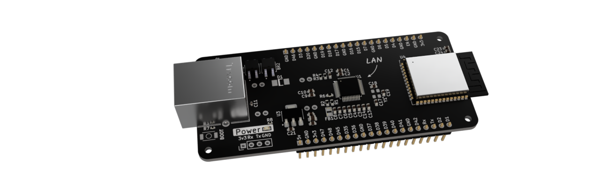

# ESP32 PoE

[](https://github.com/nrwiersma/esp32-poe/releases)
[](https://raw.githubusercontent.com/nrwiersma/esp32-poe/main/LICENSE)

`ESP32 PoE` is an ESP32 dev-kit with a W5500 LAN with PoE.



Features:

* W5500 Ethernet
* PoE (Power over Ethernet) 802.3af 7W
* ESP32 S3 WROOM-1

## Tasmota Configuration

To configure Tasmota for the ESP32 PoE board, you can use the following template:

```
{"NAME":"ESP32PoE","GPIO":[0,1,1,1,1,1,1,1,0,5536,5600,704,672,736,5568,1,1,1,1,1,1,0,0,0,1,1,1,1,1,1,1,1,1,1,1,1,1,1],"FLAG":0,"BASE":1}
```

and set the `EthType` option to `8`.

Optionally you can disable WiFi by setting `Wifi` option to `0` in the consoleSt.

## BOM

See the [Interactive BOM](https://htmlpreview.github.io/?https://github.com/nrwiersma/esp32-poe/blob/main/bom/ibom.html) [(provided by InteractiveHtmlBom)
](https://github.com/openscopeproject/InteractiveHtmlBom).

## Why

When dealing with IoT devices, you often want to place them in locations where power outlets are not readily available. 
Power over Ethernet (PoE) allows you to power devices through the same Ethernet cable used for data transmission, 
simplifying installation and reducing cable clutter. It also allows for centralized power management, 
making it easier to monitor and control the power supply to multiple devices.

## Changelog

#### v0.1.0

* Initial schematic and board
